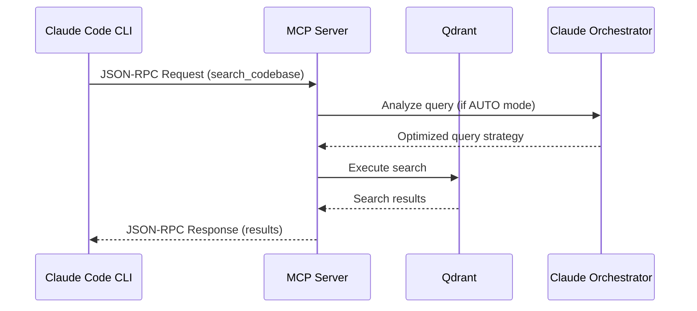

# MCP Server Integration with Claude Code CLI

## Overview

The claude-code-context MCP server is a FastMCP-based server that integrates with Claude Code CLI through the Model Context Protocol (MCP). It provides intelligent code search capabilities with Claude orchestration.

## Protocol Compliance

### JSON-RPC 2.0
The server uses FastMCP which automatically handles the JSON-RPC 2.0 protocol:
- Request/response format compliance
- Error handling with proper error codes
- Bidirectional communication support
- Automatic message ID tracking

### Response Format
All tool responses follow the MCP specification:
```json
{
  "jsonrpc": "2.0",
  "id": <request_id>,
  "result": <tool_result>
}
```

FastMCP handles the JSON-RPC wrapping automatically. Our tools return dictionaries that FastMCP serializes.

## Integration with Claude Code CLI

### Installation and Setup

1. **Add to Claude Code configuration** (`.mcp.json` in project root):
```json
{
  "mcpServers": {
    "claude-code-context": {
      "type": "stdio",
      "command": "python",
      "args": ["-m", "claude_code_context.mcp_server"],
      "env": {
        "MCP_PROJECT_PATH": ".",
        "MCP_COLLECTION_NAME": "auto",
        "MCP_MAX_CLAUDE_CALLS": "10",
        "MCP_DEBUG": "false",
        "QDRANT_URL": "http://localhost:6333"
      }
    }
  }
}
```

2. **Use the CLI tool**:
```bash
# Initialize MCP configuration in project
ccc init

# Check MCP server status
claude /mcp

# Use the search capabilities
claude "Find authentication functions in the codebase"
```

## MCP Capabilities

### Tools
The server exposes the following tools through MCP:

1. **search_codebase**
   - Natural language code search
   - Supports multiple search modes (auto, payload, semantic, hybrid)
   - Returns structured search results with code snippets
   - Claude orchestration for query optimization

2. **get_server_health**
   - Server status and health metrics
   - Qdrant connection status
   - Collection availability
   - Performance metrics

### Resources
The server provides these resources:

1. **ccc://server/info**
   - Static server information
   - Capabilities listing
   - Configuration details
   - Version information

### Prompts
Pre-defined prompt templates for common search patterns:

1. **find_implementation**
   - Template for finding function/class implementations
   - Guides optimal search strategy

2. **analyze_dependencies**
   - Template for dependency analysis
   - Module relationship exploration

3. **find_security_issues**
   - Template for security vulnerability search
   - Focus area customization

## Communication Flow



## Response Structure

### Search Response
```json
{
  "success": true,
  "request_id": "search_123",
  "results": [
    {
      "entity_id": "func_123",
      "file_path": "src/auth.py",
      "name": "authenticate_user",
      "content": "def authenticate_user(...)",
      "entity_type": "function",
      "language": "python",
      "start_line": 45,
      "end_line": 67,
      "relevance_score": 0.92,
      "match_type": "hybrid"
    }
  ],
  "total_found": 5,
  "execution_time_ms": 125.3,
  "search_mode_used": "hybrid",
  "claude_calls_made": 1,
  "query_optimization": "authenticate_user login validation"
}
```

### Health Response
```json
{
  "status": "ready",
  "healthy": true,
  "qdrant_connected": true,
  "collection_available": true,
  "claude_cli_available": true,
  "uptime_seconds": 3600,
  "requests_handled": 42,
  "average_response_time_ms": 150.5,
  "orchestrator_health": {
    "search_executor": {
      "initialized": true,
      "orchestration_enabled": true
    }
  }
}
```

## Error Handling

The server handles errors gracefully and returns MCP-compliant error responses:

```json
{
  "jsonrpc": "2.0",
  "id": <request_id>,
  "error": {
    "code": -32603,
    "message": "Internal error",
    "data": {
      "details": "Collection not found",
      "suggestion": "Run 'ccc index' to create and populate the collection"
    }
  }
}
```

## Performance Considerations

1. **Startup Time**: < 5 seconds typical
2. **Search Response**: < 30 seconds for complex queries
3. **Memory Usage**: ~200MB base + embeddings cache
4. **Connection Pooling**: Reuses Qdrant connections
5. **Caching**: Project context cached for session

## Security

1. **Input Sanitization**: All queries are validated and sanitized
2. **Claude CLI Security**: Subprocess calls use safe execution patterns
3. **Error Message Sanitization**: No sensitive data in error responses
4. **Resource Limits**: Maximum query length and result limits enforced

## Debugging

Enable debug mode for detailed logging:
```bash
export MCP_DEBUG=true
export MCP_TIMEOUT=30000  # 30 second timeout for debugging
claude
```

Check server logs:
```bash
# Logs are written to stderr when running through Claude Code
# Use the debug mode to see detailed operation logs
```

## Best Practices

1. **Initialize collections before use**: Run `ccc index` to populate the search index
2. **Use appropriate search modes**: AUTO for general queries, specific modes for targeted searches
3. **Leverage prompts**: Use the built-in prompts for common search patterns
4. **Monitor health**: Check server health periodically with get_server_health
5. **Handle errors gracefully**: Check response.success before processing results

## Troubleshooting

### Server not starting
- Check Qdrant is running: `docker ps | grep qdrant`
- Verify Python environment: `python -m claude_code_context.mcp_server`
- Check logs with MCP_DEBUG=true

### Search returning no results
- Verify collection exists: `ccc status`
- Run indexing: `ccc index`
- Check collection name matches between indexer and server

### Claude orchestration not working
- Verify Claude CLI installed: `claude --version`
- Check authentication: `claude /auth status`
- Fallback mode will be used if Claude CLI unavailable

## Integration Examples

### Basic Search
```python
# In Claude Code
response = await mcp.call_tool("search_codebase", {
    "query": "authentication functions",
    "mode": "auto",
    "limit": 10
})
```

### Using Prompts
```python
# Get prompt template
prompt = await mcp.get_prompt("find_implementation", {
    "function_name": "validate_jwt_token"
})

# Execute the prompt-guided search
response = await mcp.call_tool("search_codebase", {
    "query": prompt,
    "mode": "hybrid"
})
```

### Health Monitoring
```python
# Check server health
health = await mcp.call_tool("get_server_health", {})
if not health["healthy"]:
    print(f"Server issue: {health['status']}")
```

## Version Compatibility

- **MCP Protocol**: 2024-11-05
- **FastMCP**: 2.0+
- **Claude Code CLI**: Latest version recommended
- **Python**: 3.8+

## Additional Resources

- [MCP Specification](https://modelcontextprotocol.io)
- [FastMCP Documentation](https://github.com/jlowin/fastmcp)
- [Claude Code MCP Guide](https://docs.anthropic.com/en/docs/claude-code/mcp)